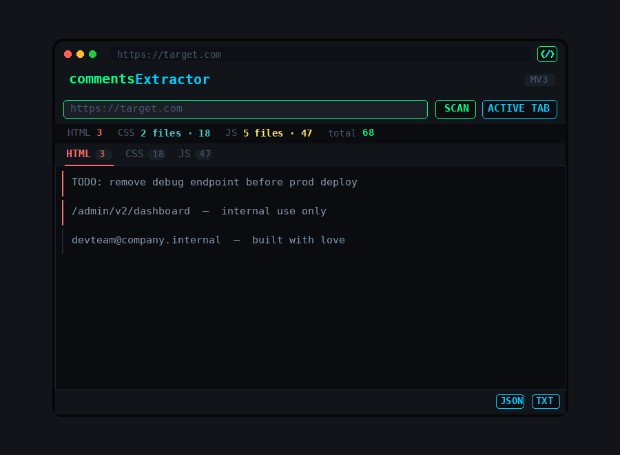

# commentsExtractor

A Chrome extension that extracts HTML, CSS, and JS comments from any webpage.

Useful for recon during web pentests — developers often leave sensitive info in comments (credentials, internal paths, TODO notes, version info, etc).

## Features

- Extracts HTML comment nodes directly from the live DOM
- Extracts comments from inline `<style>` and `<script>` blocks
- Fetches and scans external CSS and JS files
- Runs inside the page context — works on authenticated and session-protected pages
- Parallel fetching — fast even on sites with many assets
- Tabbed view (HTML / CSS / JS)
- Export results as JSON or TXT
- Scan the active tab or any URL manually

## Install

1. Clone or download this repo
2. Go to `chrome://extensions/`
3. Enable **Developer mode** (top right toggle)
4. Click **Load unpacked** and select the repo folder

## Usage

Open the extension while on any webpage and click **ACTIVE TAB**, or paste a URL manually and hit **SCAN**.

Results are grouped by source file under three tabs — HTML, CSS, and JS. Each group is collapsible. Use the JSON or TXT buttons to export everything.

## How it works

**Active tab scanning** injects a content script (`content.js`) directly into the page. It reads HTML comment nodes via `TreeWalker`, reads inline `<style>` and `<script>` blocks from the DOM, then fetches external CSS/JS files from within the page's own context. This means it has the same origin, cookies, and session as the browser — so it works on pages that require authentication.

**Manual URL scanning** runs through the background service worker (`background.js`), which fetches the raw HTML and parses it for resources.

Supports:

- `<!-- HTML comments -->`
- `/* CSS block comments */`
- `// JS single-line` and `/* JS block comments */`
